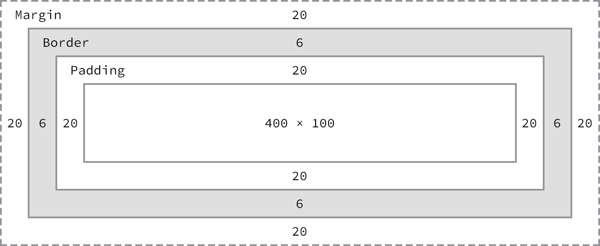
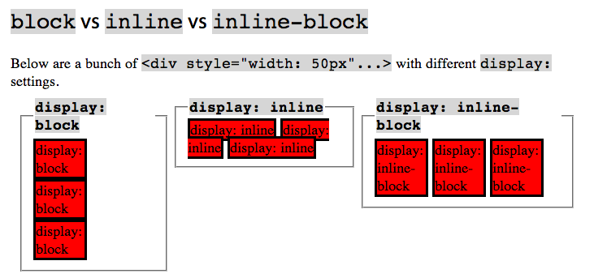
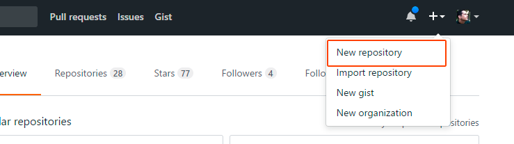
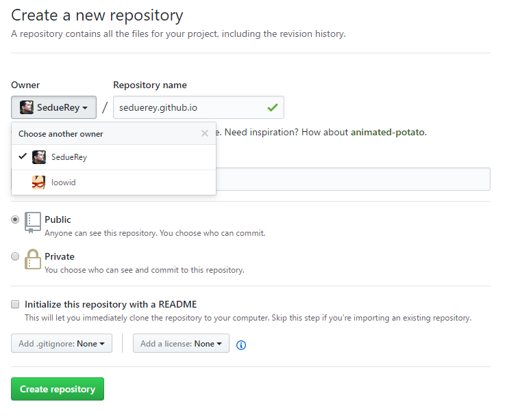
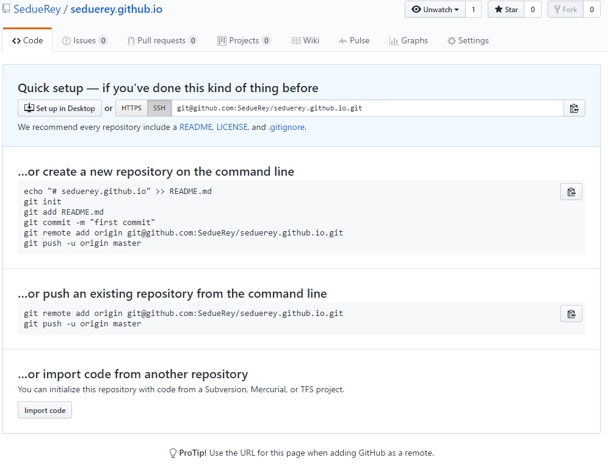

# Taller de iniciacion al desarrollo frontend

## Instalación del editor de código
Para este taller vamos a necesitar un editor de código, para aquellos que nunca han usado un editor de código recomiendo usar [brackets](http://brackets.io/), pero también podéis probar otros editores de código como [Atom](https://atom.io/) o [Sublime Text](https://www.sublimetext.com/).

Id a [brackets.io](http://brackets.io/) y descargar la aplicación que está disponible tanto para Windows como OS X y Linux. El proceso de instalación dependerá de la plataforma.

## Html 

Lo primero que tenemos que saber es que **Html** **NO es un lenguage de programación**, si no que **es un lenguage de marcas**, esto quiere decir que simplemente es un lenguaje que usamos para añadir información adicional de presentación o estructura a un texto. Así, de esta forma, podremos hacer cosas tansimples como escribir `<b>Hola Mundo!</b>` para escribir `Hola Mundo!` en negrita. Pongamos unos ejemplos de código `Html`:

- `<b>Hola Mundo!</b>` :

<b>Hola Mundo!</b>

- `<i>El frontend mola!</i>` :

<i>El frontend mola!</i>

- `<h6>Meetup Day</h6>` :

<h6>Meetup Day</h6>

Para leer una definición más completa sobre *Html*, pueden ir a [Mozilla Developer Networkd (MDN)](https://developer.mozilla.org/es/docs/Web/HTML).

También podemos ver el listado de todas las etiquetas *html* que hay en [MDN](https://developer.mozilla.org/es/docs/Web/HTML/Elemento), aunque parezca un listado enorme, no os debéis preocupar porque sólo se suelen utilizar un pequeño número de ellas.

### Etiquetas no semánticas
Hay ciertas etiquetas que no añaden información al contenido al que envuelven, éstas etiquetas son `

` y `` que simplemente nos ayudan a estructurar el documento y luego más tarde podremos modificar como se muestra su contenido en pantalla mediante reglas de estilo *Cascade StyleSheets* (*CSS*). La diferencia entre `

` y `` la veremos más adelante.

También hay otras etiquetas no semánticas como `<b></b>` y `<i></i>` que sirven para añadir información de presentación, en este caso la primera etiqueta pondría el contenido que envuelve en negrita, y la segunda etiqueta pondría el contenido en itálica. Ambas etiquetas pueden ser combinadas de forma que `<b><i>Texto en negrita y cursiva</i></b>` es un texto en negrita y cursiva. El orden de las etiquetas no es importante en este caso, en cambio si que es importante que estén cerradas en orden, es decir, `<b><i>Texto en negrita y cursiva</b></i>` no sería *Html* válido.

### Etiquetas semánticas
Son aquellas que envuelven un contenido dotándolo de cierta información adicional semántica como `<h1></h1>` que indica que el texto que contiene es un encabezado, o `<article></article>` que indica que lo que hay dentro de esa etiqueta es un artículo.

El siguiente listado es una muestra de algunas de las etiquetas semánticas que hay:

- `<article>` : Artículo
- `<aside>` : Contenido secundario
- `<footer>` : Pie de un contenido, puede ser bien un pie de página, o bien un pie de sección o artículo en combinación con otras etiquetas.
- `<header>` : Cabecera de página, sección o artículo, dependiendo de cómo se componga con otras etiquetas.
- `<nav>` : Menú de navegación.
- `
`: Párrafo.
- `<h1>`, `<h2>`, `<h3>` ... : Textos de encabezados.
- `<strong>` : Resalta un texto destacando su importancia.
- `<em>` : Emfatiza un texto.

`<strong>` y `<em>` son las versiones semánticas de `<b>` y `<i>` puesto que `<strong>` presenta el texto en negrita, pero además resalta su importancia, igualmente `<em>` presenta el texto en cursiva, pero semánticamente enfatiza el contenido.

Formar el documento correctamente de estructura y semántica ayudará a que los robots de los buscadores indexen bien nuestro contenido y nuestra página.

## CSS (Cascade StyleSheets)
Ahora que ya estamos familiarizados con *Html* vamos a ver cómo se muestran esas etiquetas en pantalla. En este proceso vamos hablar sobre lo que se conoce como *mode lo de cajas* y las propiedades *CSS* que permiten que nuestras etiquetas se representen en pantalla con estilos diferentes al estilo que el navegador aplica por defecto a las etiquetas.

### Etiquetas de bloque y en linea

### Modelo de cajas

Las etiquetas de nuestro documento se renderizan en el navegador como cajas. Estas cajas tienen tienen diferentes secciones. En la imagen de abajo se puede ver cómo se estructuran las seciones de una caja.

El ancho de la caja viene definido por el **ancho del contenido** más el **padding izquierdo y derecho** y el **borde izquierdo y derecho**, por otro lado la altura viene definida por **la altura del contenido** más el **padding superior e inferior** y el  **borde superior e inferior**. 

### Tipo de caja de de un elemento

Todos los elementos de HTML tienen una forma de visualizarse por defecto o **tipo de caja de representación** dentro del modelo, bien sea creciendo todo el espacio disponible del documento como `
`,`
`, o `<section>` o bien adaptándose al contenido del elemento que los contiene tal y como pasa con las negritas `<strong>` o cursivas `<em>` en cualquier libro aunque podremos cambiar su forma de visualización y adaptarla a lo que necesitamos mediante la propiedad `display` de CSS. `display` sería la propiedad más importante para controlar la estructura del documento. Los principales modos de visualización de un elemento HTML en CSS serían los siguientes:
 
 - **none**: Oculta por completo el elemento.

 - **block**: Hace que el elemento ocupe todo el espacio disponible a lo ancho, tanto a derecha como hacia la izquierda, como un párrafo en un libro y llegará hasta el final del espacio disponible , aunque sus contenidos del elemento no ocupen todo el sitio. Los elementos que tienen este comportamiento por defecto serían todos los encabezados (`<h1>` a `<h6>`) y contenedores de elementos (`
`, `<section>` o `<article>`, por ejemplo)

 - **inline**: Este modo de estructurar la etiqueta hace que el elemento únicamente ocupe el espacio necesario para mostrar su contenido y sin interrumpir el flujo de texto del elemento que lo contiene. Como etiquetas más representativas de este `display: inline` tendríamos los enlaces `<a>` y el elemento para agrupar texto ``. Un ejemplo lo podemos ver en la imagen a continuación. Todo elemento que tienen la propiedad inline ignorarán muchas otras propiedades de CSS como `width`, `height` o `margin` que sí se aplican a los elementos `block` o `inline-block`. La propiedad `padding` **sí** funcionará.

 - **inline-block** sería un híbrido entre ambos, haciendo que el elemento no corte el flujo del elemento que lo contiene pero saltando de línea como bloque entero si no encuentra espacio suficiente en la línea que lo contiene.

 

 Como hemos comentado, cada etiqueta HTML tiene un valor de display por defecto. Usaremos esta propiedad cuando necesitemos que se comporte semánticamente de una manera distinta a la que el diseño nos podría dar a entender. Por ejemplo, una lista de enlaces de un menú, maquetada con un `<ul>` dentro de un `<nav>` podemos convertirlo en un menú horizontal haciendo que cada `<li>` sea un elemento con `display: inline-block;`.

### Posicionamiento

CSS nos permite modificar el comportamiento para que nuestras etiquetas puedan renderizarse en otro lugar diferente al que se renderizarían por defecto. Para ello, utilizaremos la propiedad *CSS* `position`. Esta propiedad puede tomar cuatro valores: `static`, `relative`, `fixed` y `absolute`.

- **static**: Es el posicionamiento por defecto. Las etiquetas se renderizarán de arriba a abajo y de izquierda a derecha cuando las etiquetas se muestre en linea (con `display: inline`).

- **relative**: Nos permite *empujar* la etiqueta respecto a la posición en la que sería renderizada por defecto. Se puede usar en combinación de las propiedades *CSS* `top`, `right`, `bottom` y `left` para desplazarlo un número de *píxeles* u otra medida desde arriba, la derecha etc.

- **fixed**: Nos permite fijar un elemento o etiqueta en una posicion determinada de la pantalla. El elemento siempre permanecerá en esa posición de la pantalla aunque hamos *scroll*. También podremos usarlo en combinación con `top`, `right`, `bottom` y `left`, donde `top` será la parte superior de la pantalla, `right` será la parte derecha de la pantalla y así...

- **absolute**: Nos permite posicionar un elemento tomando como referencia el ancestro posicionado de manera diferente a `static`, de esta forma `top`, `right`, `bottom` y `left` harán referencia a ese elemento.

### Otras propiedades CSS

- `color` : color de la fuente
- `background-color`: color de fondo
- `background-image`: imagen de fondo
- `font-family`: tipo de fuente, se pueden enlazar múltiples tipografías desde [Google Fonts](https://fonts.google.com/)
- `font-size`: tamaño de la fuente. Por defecto los navegadores usan 16px de tamaño de tipografía. Tenedlo en cuenta.
- `width`: ancho
- `height`: alto

[referencia de todas las propiedades *CSS*](https://developer.mozilla.org/es/docs/Web/CSS/Referencia_CSS)

### Siguientes pasos
En esta documentación del taller nos dejamos muchas cosas por explicar, aunque si que se explicarán durante la ejecución del taller, no obstante quiero hacer un pequeño listado de las cosas importantes que 
no están aquí documentadas cómo: 

- Selectores *CSS*, aplicar estilos a elementos por `id`, `clase`, atributos de la forma `a[href]` etc...
- **Otros modos de representar etiquetas en la pantalla** tales como `display: table`, `display: inline-block` o el mas reciente y potente `display: flex`. 
- *Flotar* elementos en pantalla con `float: left` y `float: rigth`. 

## Subir tu proyecto a Github Pages

[Github pages](https://pages.github.com/) es un espacio de almacenamiento que nos provee github en el que podemos subir nuestras páginas web estáticas (no permite *scripting* de servidor, únicamente de cliente). Estas páginas siempre serán de la forma *tuusuario*.github.io, en nuestro caso, por ejemplo, [este enlace](https://murciafrontend.github.io/taller-frontend-meetup-day/) donde hemos subido un proyecto de prueba. Si tenéis un proyecto público en github con su propio usuario como organización también serviría.

Para crear una web en *github pages* es bastante sencillo. Únicamente hay que entrar dentro de vuestro perfil de github y crear un nuevo repositorio desde el enlace que se ve en la captura:

Una vez dentro de la página que enlaza nos da la opción de crear nuestro repositorio bien con nuestro usuario o con la organización a la que pertenezcamos (lo que comentaba antes de los repositorios para proyectos). En ambos casos el nombre del repositorio **debe** coincidir con el del usuario. Como veis en la captura, [loowid](loowid.github.io) o SedueRey.

Una vez que el repositorio esté creado github nos provee los pasos a seguir para configurarlo en nuestro ordenador para subir los HTML + CSS + JS que consideremos. Podréis hacerlo mediante línea de comandos o vuestro software para `git` preferido ([Tortoise](https://tortoisegit.org/), [Gitkraken](https://www.gitkraken.com/), vuestro IDE, etc... )

Vuestro repositorio dará un 404 por parte de github mientras lo tengais vacío o no haya un `index.html` desde el que cargar la primera página del repositorio. Si se añaden subcarpetas al repositorio funcionaría igual, sería necesario añadir un punto de acceso mediante un `index.html`.

## Recursos

- [Learn to Code HTML & CSS from @shayhowe](http://learn.shayhowe.com/html-css/)
- [Mozilla Developer Network](https://developer.mozilla.org/es/)
- [Tachyons](http://tachyons.io/)
- [Bootstrap](http://getbootstrap.com/)
- [Dwyl learn tachyons](https://github.com/dwyl/learn-tachyons)
